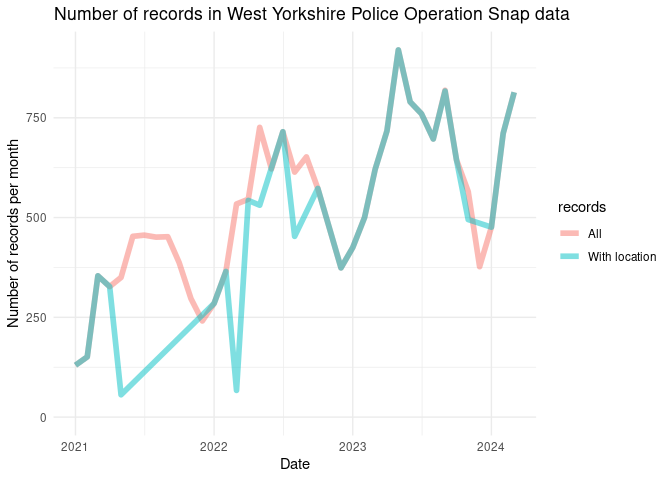
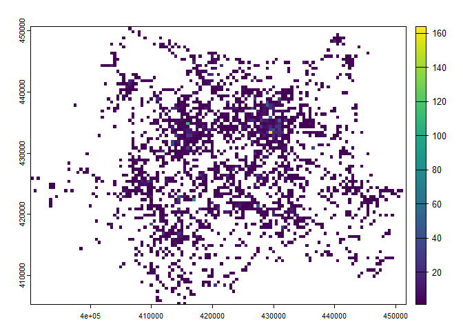

<!-- badges: start -->

[](https://github.com/ITSLeeds/opsnap/actions/workflows/R-CMD-check.yaml)
<!-- badges: end -->

# Note

This package is in development and not yet on CRAN. If you would like to
use it, please install it from GitHub as shown below, and cite it as
follows:

Farrell, G., Lovelace, R., & O’Hern, S. (2024). Road User Video Evidence
of Road Traffic Offences: Preliminary Analysis of Operation Snap Data
and Suggestions for a Research Agenda.
https://doi.org/10.31235/osf.io/cgjmr

    @misc{farrellRoadUserVideo2024,
      title = {Road {{User Video Evidence}} of {{Road Traffic Offences}}: {{Preliminary Analysis}} of {{Operation Snap Data}} and {{Suggestions}} for a {{Research Agenda}}},
      shorttitle = {{{ROAD USER VIDEO EVIDENCE OF ROAD TRAFFIC OFFENCES}}},
      author = {Farrell, Graham and Lovelace, Robin and O'Hern, Steve},
      year = {2024},
      month = jul,
      publisher = {OSF},
      doi = {10.31235/osf.io/cgjmr},
      urldate = {2024-07-29},
      archiveprefix = {OSF},
      langid = {american},
      keywords = {antisocial driving,dangerous driving,near misses,Operation Snap,OpSnap,roas safety,Video evidence}
    }

Read the full paper [here](https://osf.io/cgjmr/download/).

# Installation

Install the package from GitHub:

# Opsnap data

The `opsnap` package provides a function to download and read in data
from the West Yorkshire Police Operation Snap database. The data is
available at the following URL:
https://www.westyorkshire.police.uk/SaferRoadsSubmissions

Data for the following years are provided:

| file_names                             |
|:---------------------------------------|
| operation_snap_april-june_2024_0.xlsx  |
| operation_snap_jan-march_2024.xlsx     |
| operation_snap_oct-dec_2023_0.xlsx     |
| operation_snap_july-sept_2023.xlsx     |
| operation_snap_apr-jun_2023_data.xlsx  |
| operation_snap_jan-mar_2023_data.xlsx  |
| operation_snap_oct-dec_2022_data.xlsx  |
| operation_snap_jul-sept_2022_data.xlsx |
| operation_snap_apr-jun_2022_data.xlsx  |
| operation_snap_jan-mar_2022_data.xlsx  |
| operation_snap_2021_data.xlsx          |

The data is open acess and looks like this, with names cleaned up by the
package:

``` r
u = "https://www.westyorkshire.police.uk/sites/default/files/2024-01/operation_snap_oct-dec_2023_0.xlsx"
d = opsnap:::download_and_read(u)
names(d_with_location)
# Old names:
#  [1] "REPORTER TRANSPORT MODE" "OFFENDER VEHICLE MAKE"  
#  [3] "OFFENDER VEHICLE MODEL"  "OFFENDER VEHICLE COLOUR"
#  [5] "OFFENCE"                 "DISTRICT"               
#  [7] "DISPOSAL"                "DATE OF SUBMISSION"     
#  [9] "...9"                    "OFF LOCATION"
# New names:
# [1] "mode"     "make"     "model"    "colour"   "offence"  "district" "disposal"
# [8] "date"     "location"
```

<!-- The data looks like this (first 3 rows shown): -->

| mode | make | model | colour | offence | district | disposal | date | location |
|:---|:---|:---|:---|:---|:---|:---|:---|:---|
| vehicle driver | bmw | x3 | black | rt88966 motor vehicle fail to comply with endorsable s36 traffic sign | bd | educational course | 2024-01-01 | a6033 keighley road, hebden bridge |
| vehicle driver | nissan | qashqai | bronze | rt88576 drive without reasonable consideration to others | ld | educational course | 2024-01-01 | canal road, bradford |
| vehicle driver | seat | leon | white | rt88575 drive without due care and attention | ld | educational course | 2024-01-01 | roundabout, junction 31 m62, normanton |

# Preliminary analysis

There are 20364 records in the data, with increasing numbers of records
over time (average n. records per month shown below):



As shown in the graph above not all (72.6%) records have values for the
‘location’ column.

The breakdown of all records by mode of transport (of the observer) is
shown below:

| mode              |     n | percent_records |
|:------------------|------:|:----------------|
| vehicle driver    | 10145 | 49.8%           |
| cyclist           |  7069 | 34.7%           |
| pedestrian        |  1467 | 7.2%            |
| vehicle passenger |   650 | 3.2%            |
| unknown           |   526 | 2.6%            |
| horse rider       |   456 | 2.2%            |
| motorcyclist      |    50 | 0.2%            |
| NA                |     1 | 0.0%            |

The offence text strings are quite long, with the most common offences
shown below:

| offence | n | percent_records |
|:---|---:|:---|
| n/a | 6375 | 31.3% |
| rt88576 drive without reasonable consideration to others | 5495 | 27.0% |
| rt88575 drive without due care and attention | 3254 | 16.0% |
| rt88975 drive motor vehicle fail to comply with red / green arrow / lane closure traffic light signals | 1555 | 7.6% |
| rt88971 fail to comply with red traffic light | 686 | 3.4% |
| rt88966 motor vehicle fail to comply with endorsable s36 traffic sign | 474 | 2.3% |
| rv86019 use a handheld phone / device whilst driving a motor vehicle on a road | 456 | 2.2% |
| rt88760 fail to comply with solid white lines | 288 | 1.4% |
| rt88751 contravene give way sign | 278 | 1.4% |
| rt88751 contravene mandatory direction arrows | 214 | 1.1% |

The equivalent table excluding records with missing location data is
shown below:

| offence | n | percent_records |
|:---|---:|:---|
| rt88576 drive without reasonable consideration to others | 5495 | 37.2% |
| rt88575 drive without due care and attention | 3254 | 22.0% |
| rt88975 drive motor vehicle fail to comply with red / green arrow / lane closure traffic light signals | 1555 | 10.5% |
| rt88971 fail to comply with red traffic light | 686 | 4.6% |
| rt88966 motor vehicle fail to comply with endorsable s36 traffic sign | 474 | 3.2% |
| rv86019 use a handheld phone / device whilst driving a motor vehicle on a road | 456 | 3.1% |
| rt88760 fail to comply with solid white lines | 288 | 1.9% |
| rt88751 contravene give way sign | 278 | 1.9% |
| rt88751 contravene mandatory direction arrows | 214 | 1.4% |
| suspected contravene weight restriction. | 213 | 1.4% |

The equivalent for cyclists, with location present and the least common
offences categorised as ‘other’, is shown below:

| offence | n | % of total |
|:---|---:|:---|
| rt88576 drive without reasonable consideration to others | 4124 | 78.0% |
| rt88575 drive without due care and attention | 568 | 10.7% |
| rv86019 use a handheld phone / device whilst driving a motor vehicle on a road | 238 | 4.5% |
| rt88975 drive motor vehicle fail to comply with red / green arrow / lane closure traffic light signals | 122 | 2.3% |
| rt88971 fail to comply with red traffic light | 57 | 1.1% |
| rt88751 contravene give way sign | 32 | 0.6% |
| rt88966 motor vehicle fail to comply with endorsable s36 traffic sign | 28 | 0.5% |
| other | 120 | 2.3% |

In terms ‘disposal’, the most common values are shown below:

| disposal           |     n | percent_records |
|:-------------------|------:|:----------------|
| educational course | 10887 | 53.5%           |
| nfa                |  6365 | 31.3%           |
| conditional offer  |  2563 | 12.6%           |
| court              |   321 | 1.6%            |
| dsit investigation |   202 | 1.0%            |
| rpu investigation  |    24 | 0.1%            |
| fine               |     1 | 0.0%            |
| NA                 |     1 | 0.0%            |

There are 8902 unique location text strings (addresses) in the data,
with the most common locations shown below:

| location                                        |   n | percent_records |
|:------------------------------------------------|----:|:----------------|
| meanwood road, leeds                            |  94 | 0.6%            |
| dewsbury road, ossett                           |  64 | 0.4%            |
| park square west, leeds                         |  59 | 0.4%            |
| tongue lane, leeds                              |  52 | 0.4%            |
| chapeltown road, leeds                          |  49 | 0.3%            |
| clayton road, bradford                          |  43 | 0.3%            |
| hollingwood lane, bradford                      |  41 | 0.3%            |
| highgate road, bradford                         |  39 | 0.3%            |
| westgate j/w park square west, leeds            |  39 | 0.3%            |
| carr hill road, upper cumberworth, huddersfield |  38 | 0.3%            |

# Geocoding

We provide a function to geocode the records:

``` r
d_sample = d_with_location[1:5, ]
d_sf = opsnap:::op_geocode(d_sample)
mapview::mapview(d_sf)
```

After geocoding all records we kept only those within the boundary of
West Yorkshire, which removed another 3% of records.

# Location of incidents

Due to inaccuracy in the geocoding, we only know the locations of the
records to within around 500m of each crash (although we can link to
specific roads). We’ll present the geographic distribution of crashes
using a 500m grid:



The map above represents 8607 incidents in West Yorkshire with an
offence that could be geocoded.

<!-- The results show there is one outlier with a very high number of crashes. We can remove this and plot the data again: -->
<!-- You can query the data downloaded with `opsnap` functions, e.g. as follows (results not shown): -->
<!-- Let's make a plot of the data: -->
