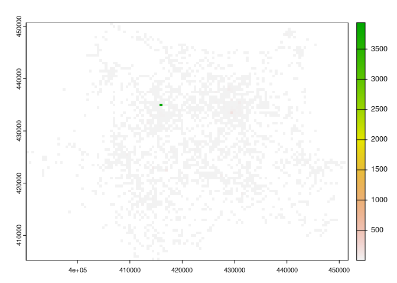
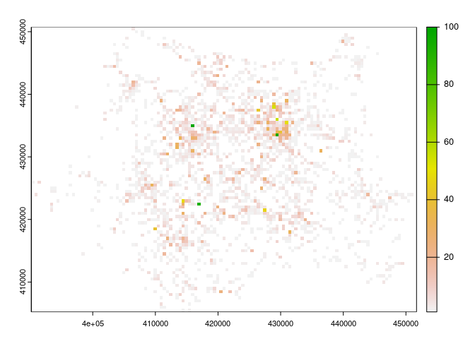

<!-- badges: start -->

[](https://github.com/ITSLeeds/opsnap/actions/workflows/R-CMD-check.yaml)
<!-- badges: end -->

# Installation

Install the package from GitHub:

``` r
remotes::install_github("ITSLeeds/opsnap")
```

# Opsnap data

The `opsnap` package provides a function to download and read in data
from the West Yorkshire Police Operation Snap database. The data is
available at the following URL:
https://www.westyorkshire.police.uk/SaferRoadsSubmissions

Data for the following years are provided:

| file_names                             |
|:---------------------------------------|
| operation_snap_oct-dec_2023_0.xlsx     |
| operation_snap_july-sept_2023.xlsx     |
| operation_snap_apr-jun_2023_data.xlsx  |
| operation_snap_jan-mar_2023_data.xlsx  |
| operation_snap_oct-dec_2022_data.xlsx  |
| operation_snap_jul-sept_2022_data.xlsx |
| operation_snap_apr-jun_2022_data.xlsx  |
| operation_snap_jan-mar_2022_data.xlsx  |
| operation_snap_2021_data.xlsx          |

The data is open acess and looks like this, with names cleaned up by the
package:

``` r
u = "https://www.westyorkshire.police.uk/sites/default/files/2024-01/operation_snap_oct-dec_2023_0.xlsx"
d = opsnap:::download_and_read(u)
names(d)
# Old names:
#  [1] "REPORTER TRANSPORT MODE" "OFFENDER VEHICLE MAKE"  
#  [3] "OFFENDER VEHICLE MODEL"  "OFFENDER VEHICLE COLOUR"
#  [5] "OFFENCE"                 "DISTRICT"               
#  [7] "DISPOSAL"                "DATE OF SUBMISSION"     
#  [9] "...9"                    "OFF LOCATION"
# New names:
# [1] "mode"     "make"     "model"    "colour"   "offence"  "district" "disposal"
# [8] "date"     "location"
```

<!-- The data looks like this (first 3 rows shown): -->

| mode           | make    | model | colour | offence                                                  | district | disposal           | date       | location                         |
|:---------------|:--------|:------|:-------|:---------------------------------------------------------|:---------|:-------------------|:-----------|:---------------------------------|
| Cyclist        | Honda   | JAZZ  | BLUE   | RT88576 Drive without reasonable consideration to others | BD       | Educational Course | 2023-10-01 | A650 SIR FRED HOYLE WAY, BINGLEY |
| Cyclist        | Citroen | DS3   | WHITE  | RT88576 Drive without reasonable consideration to others | BD       | Educational Course | 2023-10-01 | DALTON BANK ROAD, HUDDERSFIELD   |
| Vehicle driver | Audi    | S3    | BLACK  | RT88760 Fail to comply with solid white lines            | LD       | Educational Course | 2023-10-01 | A1 North Wetherby, Leeds         |

There are 18363 records in the data, with increasing numbers of records
over time (average n. records per month shown below):


As shown in the graph above, some records (68.9%) have missing values
for the ‘offence’ column (these records did not classify as an offence).
Many records lack either an offence or a location (48.1%). Filtering
these out leaves 8832 complete records.

There are 6478 unique locations in the data, with the most common
locations shown below:

| location                                       |   n | percent_records |
|:-----------------------------------------------|----:|:----------------|
| Meanwood Road, Leeds                           |  34 | 0.385%          |
| Westgate J/W Park Square West, Leeds           |  31 | 0.351%          |
| Dewsbury Road, Ossett                          |  29 | 0.328%          |
| Chapeltown Road, Leeds                         |  24 | 0.272%          |
| Highgate Road, Bradford                        |  22 | 0.249%          |
| M62 EASTBOUND, BRIGHOUSE                       |  19 | 0.215%          |
| Clayton Road, Bradford                         |  18 | 0.204%          |
| Tongue Lane, Leeds                             |  18 | 0.204%          |
| WESTGATE junction with PARK SQUARE WEST, LEEDS |  18 | 0.204%          |
| Manchester Road, Bradford                      |  17 | 0.192%          |

# Geocoding

We provide a function to geocode the records:

``` r
d_sample = d[1:5, ]
d_sf = opsnap:::op_geocode(d_sample)
mapview::mapview(d_sf)
```

# Analysis

Due to inaccuracy in the geocoding, we only know the locations of the
records to within around 500m of each crash (although we can link to
specific roads). We’ll present the geographic distribution of crashes
using a 500m grid:



The results show there is one outlier with a very high number of
crashes. We can remove this and plot the data again:



<!-- You can query the data downloaded with `opsnap` functions, e.g. as follows (results not shown): -->
<!-- Let's make a plot of the data: -->
