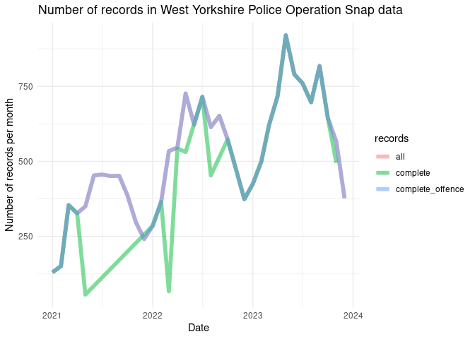

<!-- badges: start -->

[](https://github.com/ITSLeeds/opsnap/actions/workflows/R-CMD-check.yaml)
<!-- badges: end -->

# Installation

Install the package from GitHub:

``` r
remotes::install_github("ITSLeeds/opsnap")
```

# Opsnap data

The `opsnap` package provides a function to download and read in data
from the West Yorkshire Police Operation Snap database. The data is
available at the following URL:
https://www.westyorkshire.police.uk/SaferRoadsSubmissions

Data for the following years are provided:

| file_names                             |
|:---------------------------------------|
| operation_snap_oct-dec_2023_0.xlsx     |
| operation_snap_july-sept_2023.xlsx     |
| operation_snap_apr-jun_2023_data.xlsx  |
| operation_snap_jan-mar_2023_data.xlsx  |
| operation_snap_oct-dec_2022_data.xlsx  |
| operation_snap_jul-sept_2022_data.xlsx |
| operation_snap_apr-jun_2022_data.xlsx  |
| operation_snap_jan-mar_2022_data.xlsx  |
| operation_snap_2021_data.xlsx          |

The data is open acess and looks like this, with names cleaned up by the
package:

``` r
u = "https://www.westyorkshire.police.uk/sites/default/files/2024-01/operation_snap_oct-dec_2023_0.xlsx"
d = opsnap:::download_and_read(u)
names(d)
# Old names:
#  [1] "REPORTER TRANSPORT MODE" "OFFENDER VEHICLE MAKE"  
#  [3] "OFFENDER VEHICLE MODEL"  "OFFENDER VEHICLE COLOUR"
#  [5] "OFFENCE"                 "DISTRICT"               
#  [7] "DISPOSAL"                "DATE OF SUBMISSION"     
#  [9] "...9"                    "OFF LOCATION"
# New names:
# [1] "mode"     "make"     "model"    "colour"   "offence"  "district" "disposal"
# [8] "date"     "location"
```

<!-- The data looks like this (first 3 rows shown): -->

| mode           | make    | model | colour | offence                                                  | district | disposal           | date       | location                         |
|:---------------|:--------|:------|:-------|:---------------------------------------------------------|:---------|:-------------------|:-----------|:---------------------------------|
| cyclist        | Honda   | JAZZ  | BLUE   | rt88576 drive without reasonable consideration to others | BD       | educational course | 2023-10-01 | A650 SIR FRED HOYLE WAY, BINGLEY |
| cyclist        | Citroen | DS3   | WHITE  | rt88576 drive without reasonable consideration to others | BD       | educational course | 2023-10-01 | DALTON BANK ROAD, HUDDERSFIELD   |
| vehicle driver | Audi    | S3    | BLACK  | rt88760 fail to comply with solid white lines            | LD       | educational course | 2023-10-01 | A1 North Wetherby, Leeds         |

# Preliminary analysis

There are 18363 records in the data, with increasing numbers of records
over time (average n. records per month shown below):



As shown in the graph above, 100% have values for the ‘offence’ column.
Many records lack either an offence or a location, leaving only 69.6% or
12782 complete records.

The breakdown of records by mode of transport (of the observer) is shown
below:

| mode              |    n | percent_records |
|:------------------|-----:|:----------------|
| vehicle driver    | 9167 | 49.92%          |
| cyclist           | 6312 | 34.37%          |
| pedestrian        | 1352 | 7.36%           |
| vehicle passenger |  579 | 3.15%           |
| unknown           |  497 | 2.71%           |
| horse rider       |  407 | 2.22%           |
| motorcyclist      |   48 | 0.26%           |
| NA                |    1 | 0.01%           |

The offence text strings are quite long, with the most common offences
shown below:

| offence                                                                                                |    n | percent_records |
|:-------------------------------------------------------------------------------------------------------|-----:|:----------------|
| n/a                                                                                                    | 5706 | 31.0734%        |
| rt88576 drive without reasonable consideration to others                                               | 4992 | 27.1851%        |
| rt88575 drive without due care and attention                                                           | 2917 | 15.8852%        |
| rt88975 drive motor vehicle fail to comply with red / green arrow / lane closure traffic light signals | 1364 | 7.4280%         |
| rt88971 fail to comply with red traffic light                                                          |  679 | 3.6977%         |
| rt88966 motor vehicle fail to comply with endorsable s36 traffic sign                                  |  411 | 2.2382%         |
| rv86019 use a handheld phone / device whilst driving a motor vehicle on a road                         |  357 | 1.9441%         |
| rt88760 fail to comply with solid white lines                                                          |  265 | 1.4431%         |
| rt88751 contravene give way sign                                                                       |  264 | 1.4377%         |
| suspected contravene weight restriction.                                                               |  213 | 1.1599%         |

The equivalent table excluding records with missing offence data is
shown below:

| offence                                                                                                |    n | percent_records |
|:-------------------------------------------------------------------------------------------------------|-----:|:----------------|
| n/a                                                                                                    | 5706 | 31.0750%        |
| rt88576 drive without reasonable consideration to others                                               | 4992 | 27.1866%        |
| rt88575 drive without due care and attention                                                           | 2917 | 15.8861%        |
| rt88975 drive motor vehicle fail to comply with red / green arrow / lane closure traffic light signals | 1364 | 7.4284%         |
| rt88971 fail to comply with red traffic light                                                          |  679 | 3.6979%         |
| rt88966 motor vehicle fail to comply with endorsable s36 traffic sign                                  |  411 | 2.2383%         |
| rv86019 use a handheld phone / device whilst driving a motor vehicle on a road                         |  357 | 1.9442%         |
| rt88760 fail to comply with solid white lines                                                          |  265 | 1.4432%         |
| rt88751 contravene give way sign                                                                       |  264 | 1.4378%         |
| suspected contravene weight restriction.                                                               |  213 | 1.1600%         |

In terms ‘disposal’, the most common values are shown below:

| disposal           |    n | percent_records |
|:-------------------|-----:|:----------------|
| educational course | 9806 | 53.40%          |
| nfa                | 5697 | 31.02%          |
| conditional offer  | 2326 | 12.67%          |
| court              |  307 | 1.67%           |
| dsit investigation |  202 | 1.10%           |
| rpu investigation  |   23 | 0.13%           |
| fine               |    1 | 0.01%           |
| NA                 |    1 | 0.01%           |

There are 8800 unique location text strings (addresses) in the data,
with the most common locations shown below:

| location                                       |   n | percent_records |
|:-----------------------------------------------|----:|:----------------|
| Meanwood Road, Leeds                           |  49 | 0.3834%         |
| Dewsbury Road, Ossett                          |  48 | 0.3755%         |
| Westgate J/W Park Square West, Leeds           |  38 | 0.2973%         |
| Chapeltown Road, Leeds                         |  35 | 0.2738%         |
| Park Square West, Leeds                        |  33 | 0.2582%         |
| WESTGATE junction with PARK SQUARE WEST, LEEDS |  33 | 0.2582%         |
| Hollingwood Lane, Bradford                     |  27 | 0.2112%         |
| Highgate Road, Bradford                        |  26 | 0.2034%         |
| Cemetery Road, Bradford                        |  25 | 0.1956%         |
| Tongue Lane, Leeds                             |  25 | 0.1956%         |

# Geocoding

We provide a function to geocode the records:

``` r
d_sample = d[1:5, ]
d_sf = opsnap:::op_geocode(d_sample)
mapview::mapview(d_sf)
```

After geocoding all records we kept only those within the boundary of
West Yorkshire, which removed another 3% of records.

# Location of incidents

Due to inaccuracy in the geocoding, we only know the locations of the
records to within around 500m of each crash (although we can link to
specific roads). We’ll present the geographic distribution of crashes
using a 500m grid:


The map above represents 8607 incidents in West Yorkshire with an
offence that could be geocoded.

<!-- The results show there is one outlier with a very high number of crashes. We can remove this and plot the data again: -->
<!-- You can query the data downloaded with `opsnap` functions, e.g. as follows (results not shown): -->
<!-- Let's make a plot of the data: -->
