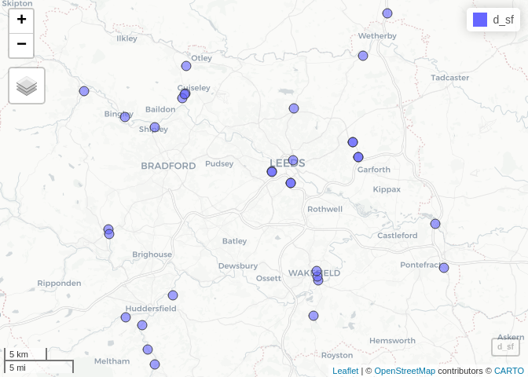
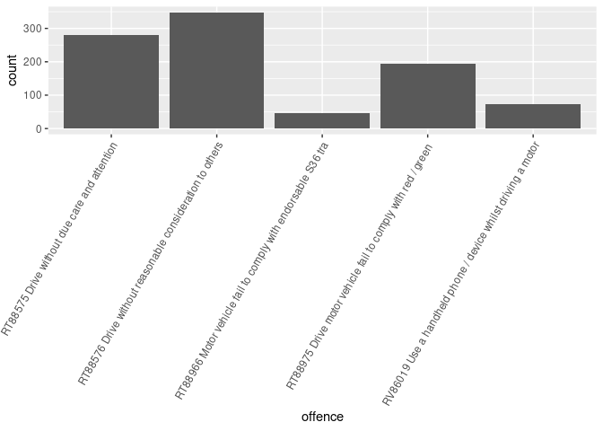

<!-- badges: start -->

[](https://github.com/ITSLeeds/opsnap/actions/workflows/R-CMD-check.yaml)
<!-- badges: end -->

# Installation

Install the package from GitHub:

``` r
remotes::install_github("ITSLeeds/opsnap")
```

# Opsnap data

The `opsnap` package provides a function to download and read in data
from the West Yorkshire Police Operation Snap database. The data is
available at the following URL:
https://www.westyorkshire.police.uk/SaferRoadsSubmissions

The data is open acess and looks like this, with names cleaned up by the
package:

``` r
u = "https://www.westyorkshire.police.uk/sites/default/files/2024-01/operation_snap_oct-dec_2023_0.xlsx"
d = opsnap:::download_and_read(u)
names(d)
```

    [1] "mode"     "make"     "model"    "colour"   "offence"  "district" "disposal"
    [8] "date"     "location"

``` r
# Old names:
#  [1] "REPORTER TRANSPORT MODE" "OFFENDER VEHICLE MAKE"  
#  [3] "OFFENDER VEHICLE MODEL"  "OFFENDER VEHICLE COLOUR"
#  [5] "OFFENCE"                 "DISTRICT"               
#  [7] "DISPOSAL"                "DATE OF SUBMISSION"     
#  [9] "...9"                    "OFF LOCATION"
```

The data looks like this (first 3 rows shown):

``` r
d |>
  head(3) |>
  knitr::kable()
```

| mode           | make    | model | colour | offence                                                  | district | disposal           | date       | location                         |
|:---------------|:--------|:------|:-------|:---------------------------------------------------------|:---------|:-------------------|:-----------|:---------------------------------|
| Cyclist        | Honda   | JAZZ  | BLUE   | RT88576 Drive without reasonable consideration to others | BD       | Educational Course | 2023-10-01 | A650 SIR FRED HOYLE WAY, BINGLEY |
| Cyclist        | Citroen | DS3   | WHITE  | RT88576 Drive without reasonable consideration to others | BD       | Educational Course | 2023-10-01 | DALTON BANK ROAD, HUDDERSFIELD   |
| Vehicle driver | Audi    | S3    | BLACK  | RT88760 Fail to comply with solid white lines            | LD       | Educational Course | 2023-10-01 | A1 North Wetherby, Leeds         |

We provide a function to geocode the records:

``` r
# Function to clean up column names
d_sample = d[1:50, ]
d_sf = opsnap:::op_geocode(d_sample)
mapview::mapview(d_sf)
```



You can query the data downloaded with `opsnap` functions, e.g. as
follows (results not shown):

``` r
table(d$offence) |>
  sort()
```

Let’s make a plot of the data:

``` r
d |>
  # Reduce nchar of offence
  mutate(offence = stringr::str_sub(offence, 1, 60)) |>
  group_by(offence) |>
  # Count number of rows in each group
  mutate(n = n()) |>
  filter(n > nrow(d) / 50)|>
  ggplot() +
  geom_bar(aes(offence)) +
  # Make x labels vertical
  theme(axis.text.x = element_text(angle = 60, hjust = 1))
```


